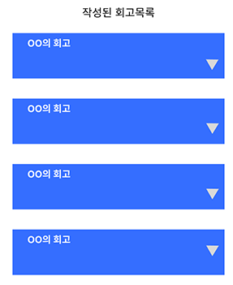

# 팀 프로젝트가 나에게 남긴 것

드디어 기다렸던 팀 프로젝트가 다가왔다. 
우아한테크코스 오기 전부터 “함께 일하고 싶은 사람"이 되자는 목표에 맞게 가장 기다렸고, 기대했던 레벨이다.

 

## 욕심 많았던 나.

우리 팀에서 애자일과 가장 거리가 먼 사람을 뽑으라 한다면, 나도 나 자신을 뽑을 것이다.

팀 프로젝트에 참여하고, 팀원들과 협업할 수록 이 프로젝트에 애정이 생기게 되었고 
그에 맞추어 나도 내가 할 수 있는 것을 더 열심히 돌려주어야겠다 하며 다짐하다 보니 욕심이 넘칠 때가 많았다.

이렇다 보니 UI/UX에서도 시간을 많이 쏟게 되었고, 내가 이걸 하는 게 맞는 걸까? 하며 혼자 스트레스도 많이 받았었고 
다른 이슈를 해결하는 것이 먼저이지 않을까? 하며 집중이 되지 않을 때도 정말 많았다.

 

## 선택과 집중.

다행히 적절한 타이밍에, 적절한 팀원들이 있어 문제들은 자연스럽게 해결될 수 있었다. 
“존대는 있지만 존중은 없다”를 강조하며, 나에게 “멈춰!”를 외치며 애자일을 지킬 수 있었던 회고덕의 수상한 팀 문화를 시작으로

어려운 기능이라도 각자 맡은 부분을 집에 가서 밤새도록 공부하고, 작업해오며 스프린트의 주요 목표에 
챌린지 목표로 잡았던 기능까지 모두 함께 이루는 팀원들까지.

이런 편한 분위기 속에서, 모두가 서로를 보며 열정 넘치게 협업을 할 수 있었기에 빠른 속도로 개발하여, 목표를 이룰 수 있었다.

 

> UI/UX가 힘들다 하니, 푸른 사각형 네개에도 진지하게 이쁘다고 박수 쳐준  **익명의 백엔드 크루 4명**은 아직도 잊을 수 없습니다. 👀

 

## 덕분에 하고 싶은 것 다 하고 있습니다.

만약 팀원들 없이 혼자 프로젝트를 진행했었더라면 
기술적인 시도보다는 시간에 쫓겨 단순한 작업만 계속 했을 것이다.

하지만 팀 프로젝트를 통해 함께 협업을 진행하며 
이전 레벨에서 코치님의 수업과 리뷰어님들의 리뷰가 왜 필요하였는지 이해되기 시작했고

팀 프로젝트 기간에는 자유롭게 의견을 제안하고, 기존에 해보고 싶었던 도전을 팀원들과 토론을 통해 
더 나은 방식으로 프로젝트에 직접 적용해볼 수 있었기에 가장 집중해서 참여했던 레벨이 아닐까 한다.

이런 경험들 덕분에 우아한테크코스에서 가장 성장을 많이 한 기간을 레벨 3 라고 자신 있게 말할 수 있을 것이다.
