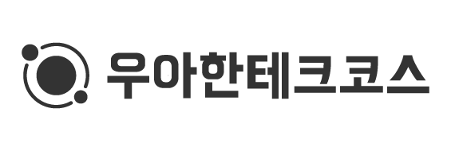

    

# 📖 글쓰기

---

> 우아한테크코스 웹 백엔드 4기, 글쓰기 미션 저장소입니다.

  

## 레벨 1 - 기록

### [🖋 우아한테크코스 한 달 생활기](level1.md)

---

- 글쓰기는 생각과 감정을 문자로 정리하고 표현하기
- 잘 써야겠다는 욕심 버리기
- 같은 팀 크루 5~6명의 글에 피드백 남기기
- 더이상 남길 피드백 없을 시 200자 내외 최종 리뷰 남기고 approve
- 최종 피드백 완료시 글 작성자는 리뷰 요청 보내기

---

## 레벨 2 - 성장

### [🖋우테코에서 찾은 나만의 효과적인 공부법](./level2.md)

---

- 본인의 `기존 학습 방식과는 다른 점`을 서술하고, 나아가 `어떻게 발전시킬 지`에 대해 작성
- `비교 & 대조`의 글쓰기를 시도해보기
    - 비교 : 둘 이상의 것을 견주어 공통점이나 유사점, 차이점 등을 설명하는 방법.
    - 대조 : 비교 중, 정반대 성격을 드러내기 위해 견주는 것.

---

## 레벨 3 - 회고

### [TBA](./level3.md)

---

## 레벨 4 - 시작

### [TBA](./level4.md)

  
