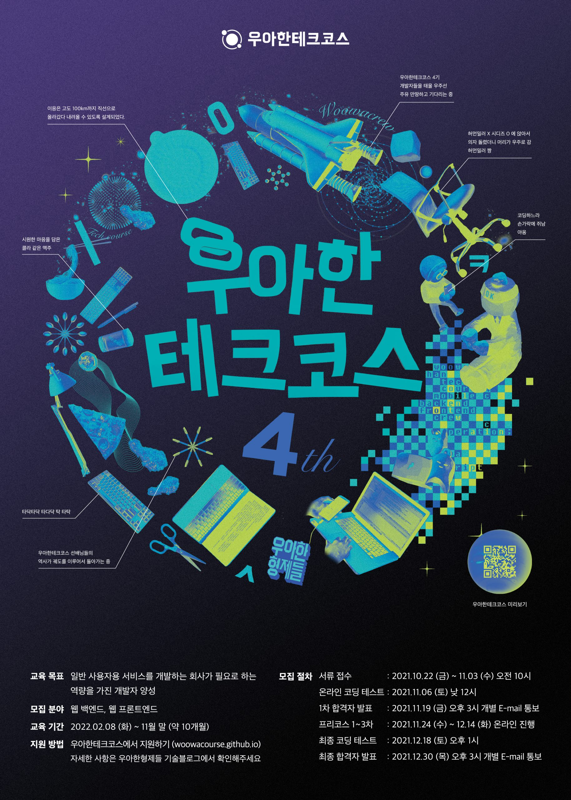

# 🖋 우아한테크코스 한 달 생활기

- 왜 여기에 왔는지 기억하기 위해 기록
- 레벨1을 마치던 시점의 나의 감정을 기억하기 위해 기록
- 앞으로의 다짐을 기록

 

# 우아한테크코스에 온 이유

---

> 대체재는 없다. 그것이 우아한테크코스에 간절히 오고 싶었던 이유다.

 

개발자를 평생의 업으로 삼은 이상 최고가 되고 싶었다.

누굴 모방해야 하는지, 어디를 목표 지점으로 삼을지 찾기 위해 두리번거렸다.

그리 오랜 시간이 필요하지 않았다.

 

우아한형제들(이하 우형)은 뭔가 달랐다.

기술적 뛰어남, 그것을 뛰어넘는 무언가가 있었다.

 

내가 접한 건 우형, 우테코가 생산한 기술 관련 콘텐츠임에도 불구하고,

**그 콘텐츠를 소비한 이후 행복감이 느껴졌다.**

존중받고 있고, 배려받고 있다는 느낌을 받았다.

 

우형에서 운영하는 [우아한형제들 기술 블로그](https://techblog.woowahan.com/) 는 존댓말로 작성되어 있다.

단순 형태를 넘어서서 글이 즐겁고 친절하다.

마음이 열리고, 글에서 전달하고자 하는 기술적인 내용이 더 잘 들어온다.

글을 읽고 난 뒤 행복하다.

 

이전 기수 우아한테크코스(이하 우테코) 수료생이 발표한 [테코톡](https://www.youtube.com/watch?v=XfYJCpAb2aE) 을 보면

웃음과 박수 소리, 호응이 넘쳐난다. 즐거움과 행복감이 전달된다.

배우는 과정에 있는 사람의 발표라고 믿기지 않을 정도로 수준 높은 발표도 굉장하다.

그들이 함께 만들어내는 학습 분위기는 더더욱 부러웠다.

 

그들의 일하는 방식, 함께 성장하는 방식이 매력적이었다.

그래서 오고 싶었다.

기술력은 다른 곳에서도 채워줄 수 있을지 모른다.

그러나 이런 문화를 가진 곳은 여기뿐이라고 확신했다.

여기에 가서 그들에게 배우고 싶고 닮고 싶고 행복해지고 싶었다.

 

참고 : [한명의 개발자를 양성하기까지](https://techblog.woowahan.com/5977/)

   

# 우테코가 나를 바꾸고 있다

---

> 지금까지 이런 교육 경험은 없었다.

 

우테코는 경쟁이 아닌 협력을 강조한다.

그래서 점수나 등수가 없다.

 

점수나 등수 대신, `함께 성장하는 법`, `함께 일하는 법`을 강조한다.

슈퍼스타가 아닌, **함께 즐겁게 일할 수 있는 사람**이 되어야 한다.

나 보다 앞서있는 사람을 보며 자책할 필요도 없다.

오직 어제의 나와 비교하며 나의 페이스대로 꾸준히 나아가야 한다.

 

우테코는 나를 나답게 해준다.

나아가 더 나은 내가 되게 해준다.

 

모든 미션의 초기 구현은 짝 프로그래밍이라는 협업의 형태로 진행된다.

협업을 마치면 함께 했던 페어(함께 작업한 크루)와 감정 회고를 한다.

페어의 발전을 위한 `부정적 피드백을 기분 나쁘지 않게 전달하는 연습`을 한다.

 

때론 [페어와 갈등](https://prolog.techcourse.co.kr/studylogs/2097) 을 겪기도 한다.

그러나 이러한 과정 마저 나를 더 나은 개발자로 만들어주는 양분이다.

협업하기 좋은 개발자로 성장하고픈 동기는, 나의 케케묵은 약점을 덮어두지 않고 들춰내게 만든다.

그리고 진심으로 이를 극복하고 싶게 만든다.

소프트스킬까지 겸비한 개발자가 되고 싶다는 욕구는, 인간 전형중을 더 나은 사람으로 만들고 있다.

 

자신의 인격적 약점을 들춰내고 고치려는 시도는 고통이 따른다.

그래서 지금껏 회피하고 누적되어 온 문제들이 있다.

우테코는 약점을 감추지 말고 빨리 드러내라고 강조한다.

우테코는 이러한 약점 드러내기에 대해 손가락질로 대하는 게 아니라 격려해주고 성장을 위해 함께 해준다.

함께 해주는 크루들, 코치분들이 있어서 변화를 위한 도전에 힘을 낼 수 있었다.

 

우테코는 나를 행복하게 만든다.

우테코 안에서 내가 성장하고 있다.

   

# 성장의 즐거움

---

> 나는 나의 페이스대로 달린다

 
기술, 문화, 사람, 처우, 모든 면에서 최고인 우형에 입사하는 것, 그곳에서 성장하는 것. 

이 욕망을 숨길 생각은 없다.

우형에 가고 싶다. 많이.. ㅋ

 

그래도 지금은, 지금의 10개월 동안은, 나만의 페이스를 유지하며 제대로 성장하는데 집중하고자 한다.

지난 한 달 동안 느낄 수 있었다.

기술적인면 뿐만 아니라, 인격적인 면에서까지 내가 변화하고 성장하고 있다는 것을.

그래서, 이 과정이 즐겁게 느껴지기 시작했다.

 

남은 9개월 동안,

나는 나의 페이스대로 달리며,

변화하고 성장할 것이다.

 
