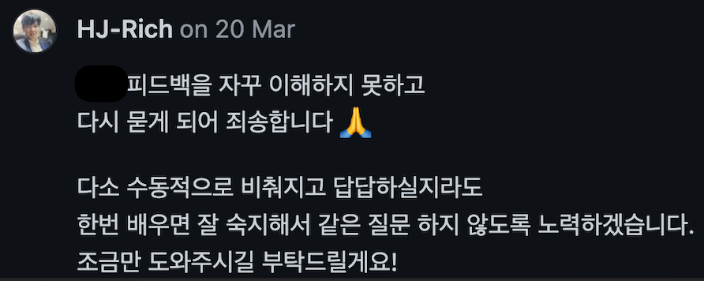
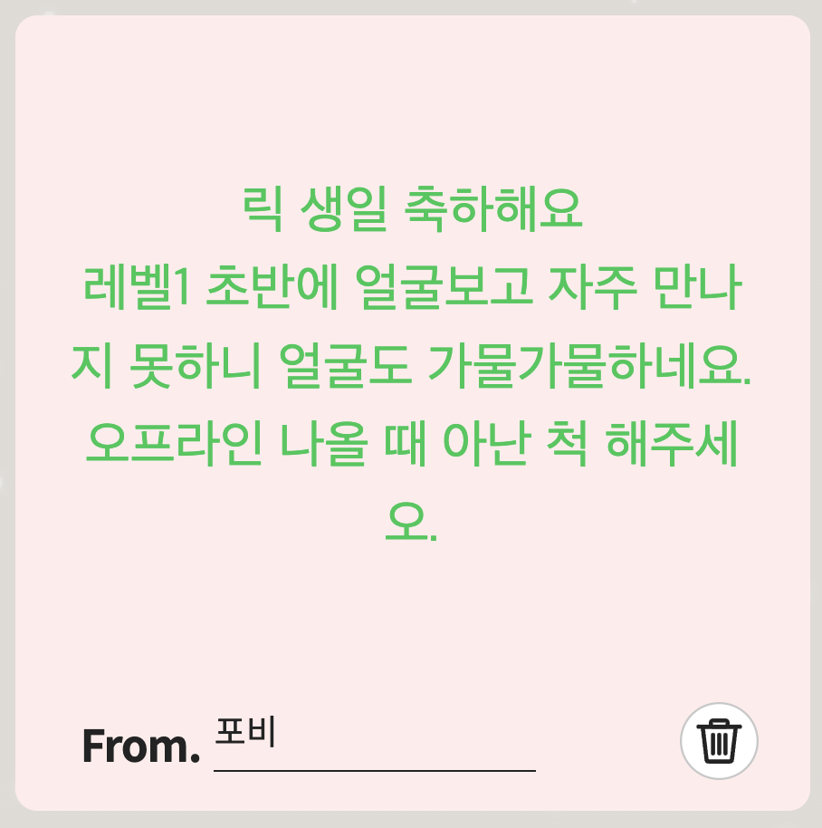
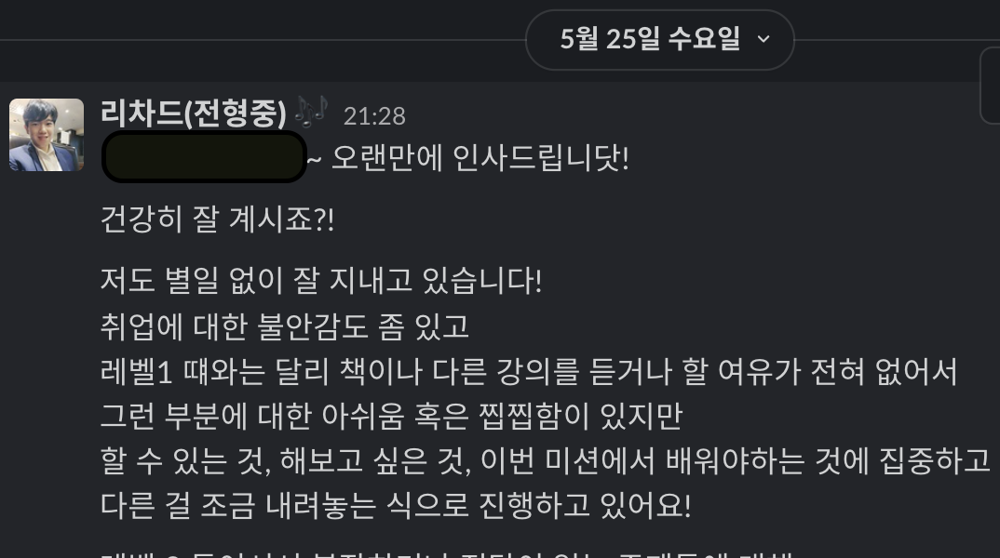

# 🖋우테코에서 찾은 나만의 효과적인 공부법

- [적극적 소통의 필요성을 발견하다](#적극적-소통의-필요성을-발견하다)
- [포비에게 메시지를 보내다](#포비에게-메시지를-보내다)
- [리뷰어에게 메시지를 보내다](#리뷰어에게-메시지를-보내다)
- [레벨 2를 마치며](#레벨-2를-마치며)

   

# 적극적 소통의 필요성을 발견하다

> 레벨 1 회고 결과였습니다.   **소통하라!**

&nbsp; 미션을 진행하며 리뷰어의 피드백을 이해하기 어려운 순간이 많았어요.
혼자서 해석을 시도하고 코드에 반영해보았지만, 번번이 리뷰어의 의도를 빗나간 시도였어요.
시간이 지날수록 자신감을 잃게 되고, 의욕도 저하되었어요.
왜 리뷰어가 본인의 의도를 분명히 드러내어 이야기해주지 않을까 원망스럽기도 했어요.

&nbsp; 그런데 또 다른 크루는 제가 어려워했던 그 리뷰어를 통해 엄청나게 성장하고 있었어요.
리뷰어와 온라인 공간에서 1:1로 만나 질문 답변을 나누고, 의견을 주고받으며 정말 긍정적인 경험을 만들어가고 있었어요.
저에겐 충격이었습니다.
문제가 제게 있다는 걸 분명히 확인시켜주는 사례였으니까요.

&nbsp; 그때는 리뷰어에게 DM 보내기조차 두려웠었어요. 리뷰어가 너무 하늘 같이 느껴졌다랄까요?
리뷰어와 편하게 소통할 수 있는 크루들이 부러웠어요.
저의 레벨 1 회고 결과는 `적극적으로 소통하자`였습니다.
다른 크루들처럼 리뷰어와 적극적으로 소통해서 더 많이 얻어가야겠다고 다짐했습니다.

   

# 포비에게 메시지를 보내다

> 생일인 크루에게 포비의 축하 메시지를 선물로 주고 싶었어요.   그래서, **포비에게 DM을 드렸습니다!**

&nbsp; 2022년 5월 7일. 저에게 큰 변화가 있었어요.
포비에게 DM을 보냈거든요.

&nbsp; 레벨 1에 같은 조였던 크루의 생일을 축하해주고 싶었어요.
그래서 같은 조였던 모두가 온라인으로 롤링페이퍼를 작성했어요.
그리고 거기에 포비도 축하 메시지를 남겨준다면 아마 특별한 선물이 될 수 있을 것 같았어요. 메시지를 열심히 작성하고 전송 버튼을 누를지 말지 엄청나게 고민했어요. 심장 떨렸거든요.
에라 모르겠다 하는 맘으로 메시지를 보냈어요.
인사말과 구구절절 사연 소개와 굽신굽신이 가득 담긴 장문의 메시지에 대한 포비의 답변은 두 글자였어요.

`ㅇㅋ`

&nbsp; 포비가 정말 축하 메시지를 남겨주셨고, 이 일로 인해 오히려 제가 큰 선물을 얻어갔어요.
그 누구에게도 DM을 보낼 수 있는 자신감이 생겼거든요.

   

# 리뷰어에게 메시지를 보내다

> 한 번 해보니, 그다음부턴 쉽더라고요!

&nbsp; 포비에게 DM을 보냈던 경험, 긍정적 결과를 얻었던 경험이 자신감으로 연결됐어요.
그 뒤로는 리뷰 요청을 드릴 때마다 리뷰어에게 DM으로 인사도 드리고 고민됐던 내용에 대해 스스로 요약해본 내용을 전달해 드렸어요.
DM으로 직접 연락을 드리다 보니 리뷰어가 가깝게 느껴지고 점점 더 편하게 느껴졌어요.

&nbsp; 리뷰어에게 만남도 요청해봤습니다! DM과 PR로 소통하는 과정에서 리뷰어의 소프트 스킬에 매료되어 꼭 만나서 이야기를 나눠보고 싶었거든요. 함께 리뷰 받는 크루들에게 의사를 확인하고
리뷰어에게 식사 혹은 티타임을 요청드렸어요. 거절하실 수도 있지만 그건 리뷰어의 자유이고, 나는 `메시지를 보낸다` 라는 생각이었어요. 감사하게도 리뷰어가 시간을 내주셨고 다 같이 식사도 하고 티타임도 가졌어요.
너무나 행복하고 유익한 시간이었고, 이후로도 계속 DM으로 종종 인사를 드리고 있어요.
레벨 2를 마친 뒤에 또 한 번 식사하기로 했답니다. 😎

&nbsp; 그리고 이 과정에서 미션, 리뷰어에 대한 저의 인식에 큰 전환이 있었어요.
이전에는 생각지 못했던 `리뷰어에게 내가 성장하는 모습을 보여주고 싶다`, `리뷰어가 자신의 피드백을 통해 내가 성장하는 모습을 보고 싶어 할 것 같다`, `리뷰어에게 보람을 느끼게 해주고 싶다` 와 같은 생각을 할
수 있게 됐어요! 이때부턴 리뷰어와 함께하는 미션이 과제나 숙제로 느껴지지 않았어요.
오히려 친절한 선생님과 함께 자유롭게 성장을 그려갈 수 있는 `연습장`처럼 느껴졌어요.
더 이상 리뷰어가 만족할만한 결과물로 만들어가기 위해 노력하지 않았어요.
`공부하고 고민한 내용들을 적용해보고 장단점을 느껴보는 의식적인 연습의 장`으로 미션 수행 과정을 활용했어요.

   

# 레벨 2를 마치며

> 조금은 뻔뻔해질 필요가 있을지도?!

&nbsp; `메시지를 보내라` 는 이 외에도 여러 가지 긍정적인 경험을 가져다줬어요.

&nbsp; 구구께 DM을 드려 티타임과 함께 라이브 코드리뷰를 받아보기도 했고요, 리뷰 받아본 적 없는 리뷰어께 DM으로 인사를 드리고 질문을 드려보기도 했습니다.
3기 분의 포스팅을 보고 궁금한 점을 DM으로 질문한 적도 있는데요, A4 2페이지 분량의 답변을 주셔서 깜짝 놀라고 감사했던 적도 있었어요.
자신을 우아한테크코스 세계 속 협력하는 하나의 객체로 바라본다면, 객체 간의 협력은 너무나 자연스러운 일 아닐까요?
협력의 방법은 메시지를 보내는 것이에요.
요청에 응하는 방식은 상대가 결정하지만, 우리가 할 일은 메시지를 보내는 거예요.
혹시 용기가 부족하시다면 포비에게 DM을 보내보세요.
그 누구에게라도 DM을 보낼 용기가 생기실 거예요 ㅎ_ㅎ

### 구현은 상대에게 맡기고, 조금은 뻔뻔해져서, 용기를 가지고, 메시지를 보내봅시다! ✉️

 

   
