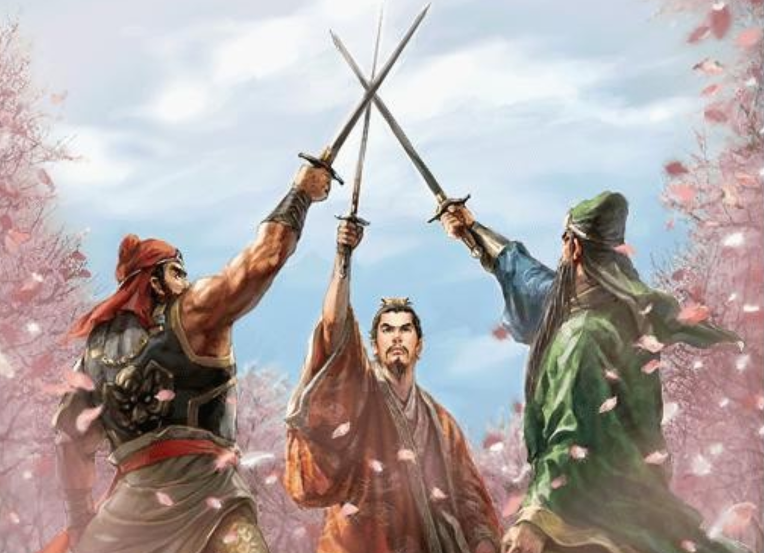

# 🖋팀 프로젝트가 나에게 남긴 것

- [🧪 독사과 리차드의 해독 도전](#-독사과-리차드의-해독-도전기)
- [💪 더욱 유연한 리차드가 되기 위해, 추상적으로 기대하기](#-더욱-유연한-리차드가-되기-위해-추상적으로-기대하기)
- [🤝 문화는 모든 구성원이 함께 만드는 것](#-문화는-모든-구성원이-함께-만드는-것)
- [🎶 닉값하자](#-닉값하자)

<br><br><br>

# 🧪 독사과 리차드의 해독 도전기

&nbsp; 안녕하세요? 줍줍 팀의 ☠️🍏독사과 리차드🎶입니다.
아쉽게도 다시 한 번 실패를 맛봐야 했네요.
이 글에서 소개할 내용은 저의 실패기입니다.
제가 왜 실패했고, 그 속에서 무엇을 배웠는지 기록해보고자 합니다.
그리고 남은 기간 🍯🍎꿀사과가 되기 위해 도전할 내용을 소개하겠습니다.
그럼 출발합니다!

<br><br>

# 💪 더욱 유연한 리차드가 되기 위해, 추상적으로 기대하기

> `우아한형제들`이 리차드의 기대만큼 좋은 회사가 아닐 수도 있다 <br> &emsp; by 네오 (레벨2 면담 중)

&nbsp; 레벨3 팀 프로젝트를 진행하기 전까지는 네오 말씀의 의미를 잘 몰랐던 것 같아요.
우아한형제들(이하 우형)에 지나친 이상을 설정하는 것의 위험성을 말씀해주고 싶으셨던 것 같아요.
레벨3 팀 프로젝트를 진행하며 그 위험성을 체감했습니다.
제 안에 `팀 프로젝트는 당연히 이러이러 해야지`, `협업은 당연히 이러이러 해야지` 등의 가정이 많았던 것 같아요.

```java
public class Richard {
    // AS-IS
    private final IdealTeamByRichard team = new IdealTeamByRichard();

    // TO-BE
    private Team team;

    public joinTeam(final Team team) {
        this.team = team;
    }
}
```

&nbsp; 변경에 유연한 코드는 구현체를 직접 의존하지 않아요.
대신 외부에서 주입해주는 인터페이스 타입을 의존합니다.
이 과정에서 인터페이스 내부의 구현에 대해 관여하지 않습니다.
다만 인터페이스에 정의된 메서드를 이용해 메시지를 보냄으로써 협력합니다.
☠️🍏독사과 리차드🎶는 이러한 설계 원칙을 지키지 못했어요.
이상적인 팀의 모습을 내부에서 구현체로 직접 의존하고 있었어요.
`제가 정의한 이상적인 팀`과 `제가 속한 팀`의 타입 불일치가 일어날 때마다 화음🎶이 아니라 잡음🔊을 일으켰어요.
남은 프로젝트 기간엔 우리 팀의 소리에 더 귀 기울이고 그에 맞는 소리를 냄으로써 화음을 만들어보고 싶어요.

<br><br>

# 🤝 문화는 모든 구성원이 함께 만드는 것

> 우형의 문화를 사랑한다면, 이에 기여할 준비가 되어있는지 증명하라 <br> &emsp; by 공원 (레벨3 면담 중)

&nbsp; `문화의 힘을 경험해보는 것`. 레벨3을 시작하며 세운 목표입니다.
당시 저에게 문화란 `뛰어난 사람들이 모이면 자연스럽게 형성되어 선순환을 이뤄내는 플랫폼` 이었습니다.
문화에 기여할 수 있는 사람인지 증명할 수 있어야 한다는 공원의 말씀도 어렵게 느껴졌습니다.
문화를 플랫폼으로 생각한다면, 이미 잘 구성된 플랫폼에 제가 무엇을 기여할 수 있는지 상상하기 어려웠기 때문입니다.



&nbsp; 그러나 지난 6주간을 되돌아보면, 문화는 플랫폼이 아니더라고요.
오히려 `구성원 모두가 영향을 주고받는, 모두 함께 기여해야 할 대상`이었습니다.
모든 구성원은 자신이 속한 조직의 문화로부터 영향을 받기도 하지만, 동시에 각 구성원이 조직 문화 형성에 기여하기도 합니다.
긍정적으로도, 부정적으로도 말이죠.

저는 독사과로서 역할을 충실히 해냈습니다!
스스로 생각하기에 우아하지 않은 팀 문화가 구축되는 데 크게 기여했음을 느꼈습니다;
제가 이상적이라고 규정해둔 방식과 다른 방식으로 진행될 때마다 구성원들의 안전감을 해치는 행동이 튀어나오곤 했거든요.
이런 모습은 결코 제가 원하는 모습이 아니었어요.
반면 꿀사과로서 역할을 해내는 동료들을 통해 긍정적인 동기부여를 받은 적이 있었어요.
필요하지만 누구도 시키지 않은 궂은 일을 스스로 나서서 열심히 해준 동료를 볼 때 저도 열정이 살아나더라고요.

이제는 `문화에 기여하라`라는 문장의 실마리를 찾은 것 같아요.
조직에 속한 모든 구성원은 상호간에 영향을 주고받을 수밖에 없다는 걸 느낍니다.
모든 구성원들은 긍정적으로 혹은 부정적으로 조직 문화에 기여하게 됩니다.
이 과정에서 각 개인은 부정적인 영향은 최소화하고, 긍정적인 영향력으로 기여할 책임이 있다고 생각합니다.
문화는 함께 만드는 것이니까요 🌼

<br><br>

# 🎶 닉값하자

> 화음을 좋아하는 리차드🎶 <br> ...?!!

&nbsp; ☠️🍏독사과 리차드는 팀원들에게 편한 동료는 아니었어요.
적극적으로 설득하려 하기보다는 포기 또는 관철로 대응했던 것 같아요.
이제 생각하면 그리 중요하지 않은 것에 과도하게 집착했던 적도 있었고요.
의견을 교환하는 과정에서 상대방에게 상처가 되는 말을 한 적도 있었어요.
(와.. 적다 보니 최악이네요 ㅋㅋ... 🥲)

저는 화음을 만들어내는 문화에 기여하고 싶어요.
여러 구성원의 장점이 녹아들어 개인의 합 보다 큰 결과를 만들어내는 문화를 형성하는 데 일조하고 싶어요.
다른 사람들의 소리에 귀 기울이고 나의 소리를 그에 맞춰 냄으로써 함께 아름다운 화음을 만들어내고 싶어요.
그 순간에 경험할 수 있는 짜릿함을 경험하고 싶어요.

네, 저도 이 모순이 정말 우습고요. 그만큼 괴로워요.
그렇지만 포기하고 싶진 않아요.
제가 반드시 가야 할 길이라고 생각해요.
`문화`에 제가 기여할 수 있는 존재라는 걸 발견한 게 레벨3에서 얻은 가장 큰 수확이에요.
남은 기간 동안 열심히 해독해서 🍯🍎꿀사과가 되고 싶어요.

레벨3 팀 프로젝트에서 좋은 팀원분들 덕분에 큰 경험을 가져가는 것 같아요.
🐹줍줍팀 감사합니다.
앞으로 닉값좀 해볼게요!

<br><br><br>
