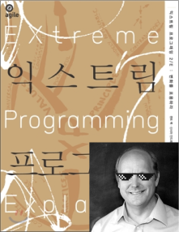

# 🖋 내가 꿈꾸는 프로그래머로서의 삶

## 변화에 유연한 삶

### 궁즉변 변즉통 통즉구(窮卽變 變卽通 通卽久)

갑자기 통닭 구이 같은 한자를 펼쳐서 미안하다. `궁즉변 변즉통 통즉구` 이라는 말은 주역에서 나온 말로 세상의 기본원리를 요약한 것이다. '궁하면 변하고, 변하면 통하고, 통하면 영원하다.'라는 뜻이다. 참고로 여기서 '궁'은 '극에 달함'을 의미한다. 마치 해가 중천에 뜨면 기울고, 달이 차면 반드시 이지러지듯이 말이다.

즉, 세상사 모든 것은 변한다. 그 변화에 적응해야만 하는 것이 세상의 섭리다. 그리고 소프트웨어의 경우 그 변화 주기가 더욱 빠르다.

유명한 소프트웨어 엔지니어인 켄트 백(Kent Beck)도 변화에 대하여 다음과 같이 이야기하였다.
> "소프트웨어의 모든 것은 변한다. 요구사항도 변한다. 설계도 변한다. 비즈니스도 변한다. 기술도 변한다. 팀도 변한다. 팀 구성원도 변한다. 변화는 반드시 일어나기 때문에 문제가 되는 것은 변화가 아니다. 변화를 극복하지 못하는 우리의 무능력이 문제다. - Extreme Programming - "

소프트웨어의 모든 것은 왜 변할까? 그 이유로 소프트웨어나 관계자들의 문제라고 생각할 것이 아니라, 그냥 그 분야에 관련된 것들이 `극에 달했기 때문`이며 소프트웨어 분야의 성장 속도가 그만큼 더 빠르기 때문에 더 예민하게 느껴지는 것일 뿐이다.

마치 JQuery가 기울고 React가 떠올랐듯이, 앞으로도 우리가 배운 것 중에 영원한 것은 없을 것이다.

## 오히려 좋아

이제는 변화를 문제로 대할 것이 아니라 "오히려 좋아" 식으로 접근해야 한다.
변화가 있기 때문에, 성장할 수 있는 것이다. 그러나 이러한 변화를 계속해서 강요받는 것은 극심한 스트레스라고 말하는 사람도 있을 것이다. 스트레스를 어떻게 바라봐야 할까? 평생을 스트레스 속에서 살지만, 영원히 사는 동물이 있다. 바로 랍스터이다.

랍스터는 아주 단단한 껍질 안에서 사는데, 자랄수록 단단한 껍질이 그들을 조여오는 스트레스 상황을 겪는다. 그들은 결국 많은 에너지를 써서 껍질을 벗고 새로운 껍질을 만든다. 이러한 과정을 통해 랍스터들은 이론적으로 영원히 살 수 있으나, 껍질을 벗어내지 못하고 껍질에 끼어 죽는 사고사의 비율이 높다고 한다. 랍스터들이 더 이상 성장하지 않고 자신의 단단한 껍질 안에 숨으면서, 조여오는 스트레스를 진통제나 쾌락을 통해 무시했다면 랍스터는 그 명성처럼 위엄있게 오래 살진 못했을 것이다.

즉, 스트레스가 발생했을 때, 이를 성장할 때가 된 것으로 이해하고 "오히려 좋아"라는 마인드로 임한다면 성장할 수 있다.

### 어떻게 유연하게 변할 것인가

하지만 주역의 그다음 문구인 `변즉통(변하면 통하고)`은 쉽게 납득이 되진 않는다. 단순히 변하기만 하면 무조건 통한다는 것도 쉽게 믿긴 어렵다. 이는 무한 반복문 내 if문과도 같을 것이다. 결국 통할 때까지 변해야 한다. 앞으로 다음과 같이 세 가지 방법을 통해 유연하게 변하고자 한다.

첫 번째, 호기심과 재미를 갖자. 변화하는 새로운 기술에 호기심을 갖고 아직 잘하지는 못하더라도(처음에는 당연히 못 하지), 그냥 '재미'로 시도해본다. 팀프로젝트 때 PWA를 해보았던 것이 그러하였고, 얼마 전에는 제목부터 발칙한 '멀티쓰레드 기반 자바스크립트' 란 책을 사서 읽으려고 벼르고 있다. 누군가는 나에게 물을 것이다. "도대체 그런 책은 왜 읽어요?" 진짜 별 이유 없이, 싱글쓰레드 기반이라고 배운 자바스크립트에 멀티쓰레드 기반이라는 수식어를 붙이다니, 이 또한 세상 변화의 일부인 것 같아 흥미로워서 읽고 싶다.

두 번째, 함께 변화하자. 이는 위에서 말한 재미와도 연결되는 내용인데, 주위의 동료와 함께 변화해야 더 재밌다. 거대한 소프트웨어 바닷속에서 혼자 변화해봤자 결국 변화된 그것을 사용하는 사람이 적다면 그 노력은 무용지물이다. 자신이 배운 것을 남에게 공유하고, 여럿이서 새로운 분야에 함께 흥미를 갖고 도전해야 성장할 수 있다.

세 번째, 기술에 매몰되진 말자. 때로는 나무보다는 숲을 봐야 할 때가 있을 것 같다. 우리가 열심히 작성한 코드를 통해 나온 기대하는 대로 작동하는 서비스가 나오는 것만이 중요한 게 아니라, 실제로 사용자들이 만족하고 사용하는 서비스가 되는 것도 중요하다. 더 나은 서비스를 만들기 위해서는, 기술뿐만 아니라 사용자 입장도 살필 수 있는 개발자가 되어야 한다고 생각한다.

이와 같은 점을 염두하여 결국 `통즉구(통하면 오래간다)` 할 수 있는 개발자가 되고 싶다. 아니, 개발자라는 직업도 시대에 따라 어떻게 변할지도 모른다. 그저 계속해서 새로운 가치를 만들 수 있는 사람이 되고 싶다.
