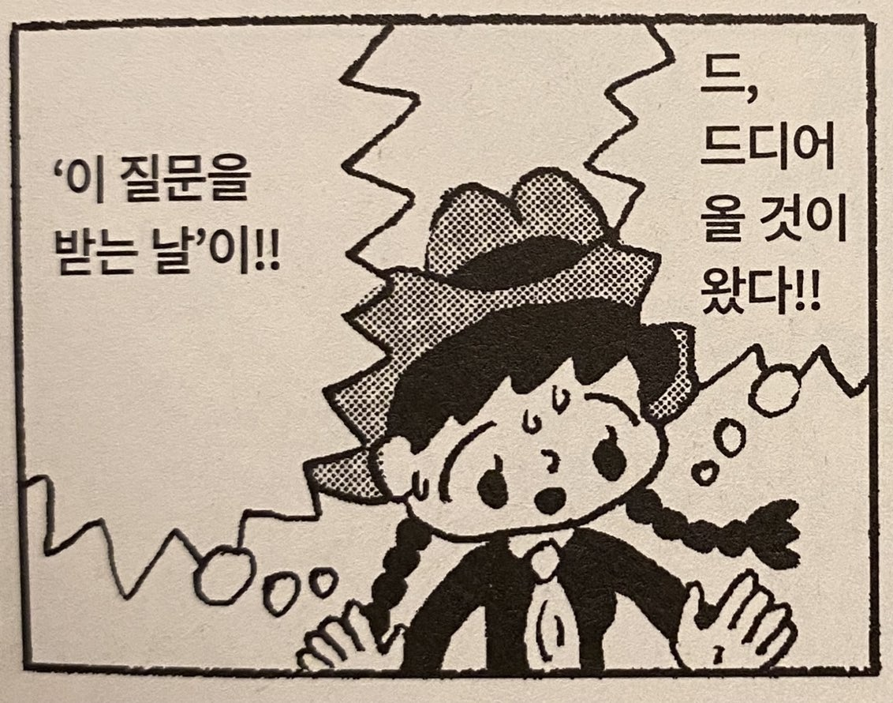

## 당신은 어떤 개발자가 되고 싶나요?

엄마 vs 아빠, 순살 vs 뼈, 짜장면 vs 짬뽕, type alias vs interface. 선택이란 참 괴롭다. 수많은 갈림길 사이에서 하나를 정해야 한다는 건 다른 모든 경험을 포기해야 한다는 뜻이니까. 20년 전의 나는 자동차 디자이너가 되고 싶었다. 7년 전에는 음악을 하며 살고 싶었고 2년전에는 어떤 개발 분야를 해야 할지 고민하고 있었다. 하고 싶은 게 너무 많아서일까? 어떤 개발자가 되고 싶으냐는 질문이 나에게는 너무나 어렵다.

마음 같아서는 "여러 사람에게 도움이 되는 서비스를 개발하며 함께 일하고 싶고 돈도 많이 버는 개발자가 되고 싶어요!"라고 하고 싶다. 하지만 그건 욕심이라는 걸 알기에 대신 좋아하는 것들을 적어보기로 한다.

**나는 새로운 것을 좋아한다.** 이전에 알지 못한 것들을 알아가고 나의 세계를 넓히는 것에 즐거움을 느낀다.

**나는 멋진 것을 만들기를 좋아한다.** 음악이든 개발이든 멋진 무언가를 만들었을 때 행복을 느낀다.

**나는 모험을 좋아한다.** 권태로운 삶에서 벗어나 남들이 가지 않은, 어디로 통할지 모르는 샛길에서 마주치는 우연과 낯선 환경에 흥미를 느낀다.

금방금방 생각난 것들이 내가 개발을 시작한 이유와 닿아있었다. 7살 인생 처음 본 친구네의 펜티엄3 컴퓨터는 신기하고 새로운 것이었고, 컴퓨터학원에서 배운 C언어로는 별로 크리스마스트리를 그리는 멋진 일을 할 수 있었다. 잠시 전공 수업에 지쳐 개발에 흥미를 잃고 방황하기도 했지만 우테코라는 곳에서 만난 크루들과 함께 밤새 서비스를 개발하며 평생 잊지 못할 경험을 하기도 했다.

취향이 사람을 만든다. 좋아하는 것들로 나라는 사람을 정의할 수 있다면 내가 어떤 개발자가 되고 싶은지도 알 것 같다. 새롭고 멋진 무언가를 만들며 내가 좋아하는 사람들과 함께 모험하는 개발자가 된다면 이 일을 오래오래 할 수 있지 않을까?
