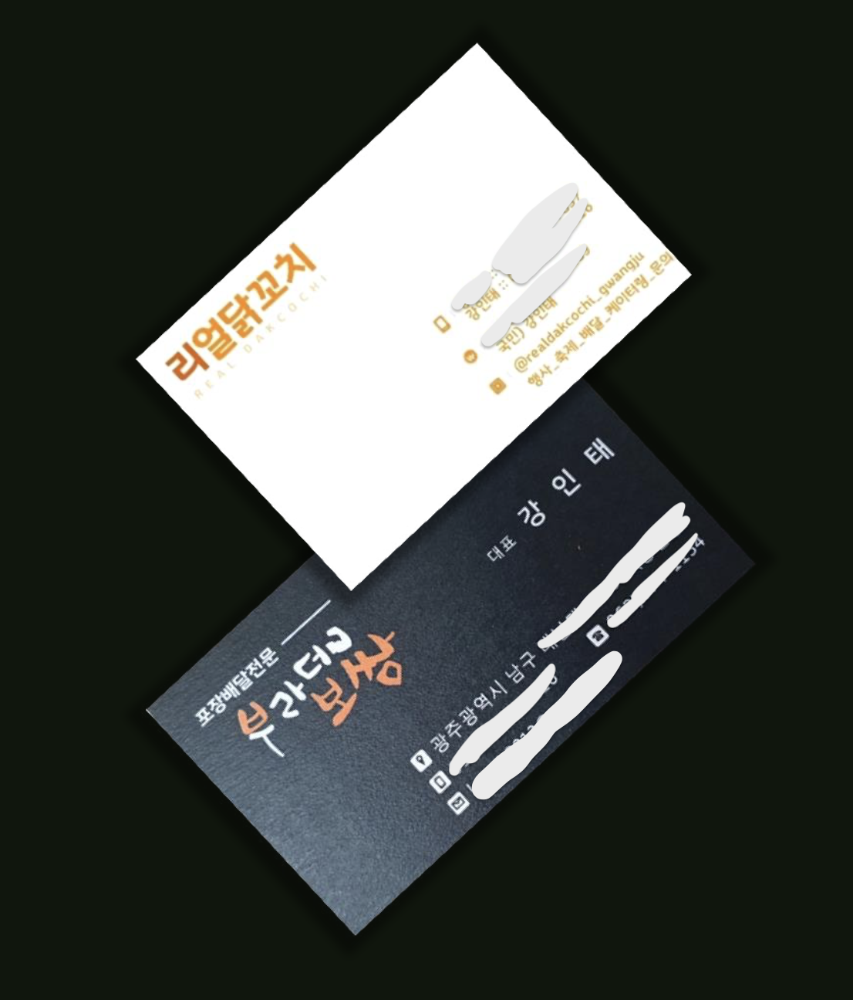

# 장사를 했었는데요?!

    

 

- [부라더보쌈 SNS](https://www.instagram.com/brother___1155/?hl=ko)
- [리얼닭꼬치 SNS](https://www.instagram.com/realdakcochi__gwangju/?hl=ko)

리어카에서 붕어빵을 팔고, 푸드트럭에서 닭꼬치를 팔고, 음식점을 개업해 보쌈을 팔았습니다. 노점에서 시작해 매장을 개업했던 소중한 추억을 가지고 있는데요. 큰 꿈을 가지고 장사를 시작한 건 아니었어요. 그저 "자신의 가게를 차리고 싶다!!"라는 꿈을 가진 지인들의 영향을 받아 장사를 하게 되었습니다. 지인들의 꿈이 멋있어 보였거든요.
제 인생에 영향을 줄 만큼 제 주변에는 장사하는 지인들이 많습니다. 글을 쓰고 있는 지금도 자신의 가게를 운영하는 분들도 계시고요. 그만큼 외식업과 소상공인분들의 고충을 많이 알고 있습니다.

장사를 하다 보면 음식도 만들어야 하고 손님 접객도 해야 하지만 그 이외에 세금, 결제, 주문, 재고, 비용처리 등 매장 운영에 필요한 다른 부분도 신경을 써야 합니다. 단순하게 음식을 만들고 손님에게 드리면 되는 것이 아닙니다. 결국 매장 운영을 신경 써야 하는데 이 부분들이 디지털화 되어 있고 복잡합니다. 결제 부분에 대해 예를 들면 카드 결제, 모바일 쿠폰 결제, 삼성페이, 키오스크 무인 결제, 온라인 주문 결제, 배달 서비스로 인한 모바일 결제 등 다양합니다. 결제하기 위해서는 IT 서비스 업체에서 만든 결제 방법을 알아야 해요. 또한 다양한 결제 방식 때문에 수익으로 들어오는 돈을 예측할 수 없습니다. 직장인 같은 경우에는 매달 정해진 날짜에 월급이 들어오지만, 소상공인분들은 수익에 대한 돈이 매주 다양한 곳에서 들어옵니다. 아무튼 수익에 대한 돈이 들어오면 되는 거 아니야? 라고 생각을 하실 수도 있지만 예측할 수 없는 수익으로 인해 자금관리가 어려워집니다. 다음 주 장사를 준비하기 위해 식자재를 주문하고 필요한 물건이 있다면 물건도 사야 하고 직원이 더 필요하면 직원도 고용해야 하는데 수익이 정확히 얼마인지, 비용이 얼마나 나가는지 정확히 알 수가 없어서 자금관리에 평소보다 더 많은 시간을 쏟아야 합니다.

이런 결제에 대한 문제 말고도 요새는 주문에 대한 어려움도 있어요. 비대면으로 인해 키오스크 무인 주문, 배민, 요기요, 쿠팡이츠와 같은 배달 주문, 네이버 플레이스 주문, 웨이팅 시스템과 같은 정말 다양한 서비스가 생겼습니다. 서비스마다 화면도 다르고 사용하는 방식도 다릅니다. 더 큰 문제는 주문서(주문 전표)를 출력하는 프린터기와 연동이 되어야 하는데 많은 IT서비스가 원활하게 연동이 될까요? 생각만 해도 머리가 어지럽네요. 편리한 외식문화를 위해 IT서비스가 생겨났지만 정작 외식업에 종사하는 분들은 많은 고충을 겪고 있습니다.

이런 문제점을 겪을 때마다 외식업 분야의 IT서비스를 진심으로 개선하기 위해 노력하는 사람들이 있을까? 라는 의구심이 들었습니다. 그리곤 이런 생각이 들었어요. "내가 고칠까?", "내가 개선하면 편리한 서비스를 제공할 수 있을 텐데!!!" 생각은 행동으로 옮겨져 개발자라는 길을 가고 있습니다.

긴 글 읽어 주셔서 감사합니다.
외식산업에 편리한 서비스를 제공하는 것을 목표로 둔 프론트엔드 개발자 강인태이었습니다.
