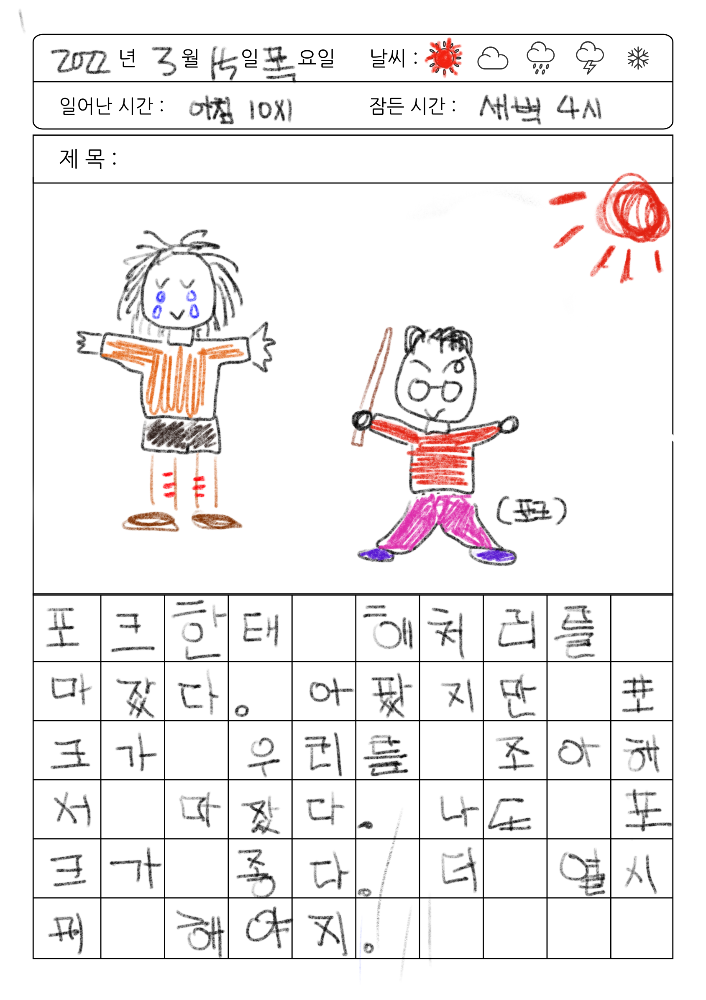
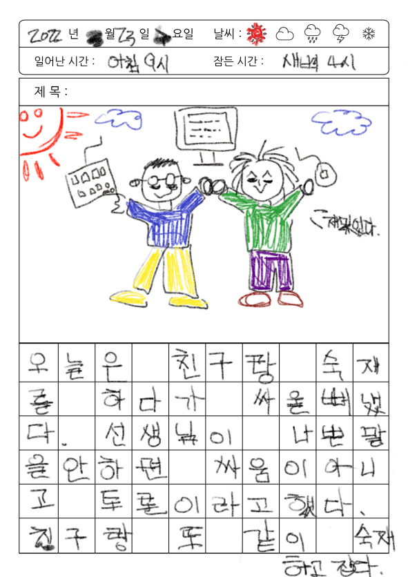

---

## 나는 쇠가 되기로 했다.

가장 오래된 어린 시절 기억은 6살 때이다.
밤에 몰래 게임을 하다가 걸린 밤 어머니의 불호령이 떨어졌다.
'뭘 잘못했냐. 매 가져와라'는 말에 나는 닭똥 같은 눈물을 집어삼키고 입을 꾹 다물고 있었다.
조금만 일찍 태어났더라면 독립투사가 됐을 법 한 꼬맹이였다.
이렇듯 나는 혼나는 것을 누구보다 싫어하는 천성을 가지고 있었다.

잘못을 인정하는 것은 굉장히 자존심 상하는 일이라고 생각해왔다.
그래서인지 처음 남에게 내 코드를 보여주는 것은 치부를 보여주는 것만큼이나 부끄러운 일이었다.
그러나 쇠는 두들길수록 단단해진다고 했던가, lv1 동안 몇 번의 피드백을 거치고 난 뒤 달라진 나를 발견했다.
평가를 잘 받기 위해서가 아니라 리뷰어와 의견을 나누다 보니 오히려 나를 더 드러내고 싶어졌다.

글을 쓰면서 처음 날렸던 PR을 들춰보았다.
정해진 답을 찾으려는 모습은 지워내고, '내가 모르는 게 무엇일까.' 물어보는 나로 조금은 성장한 것 같다.
코치님들이 던져주는 질문들에 대답하지 못하는 날 보면서 자존심이 상하기보단, 더 발전할 수 있는 가능성을 볼 수 있게 됐다.
이제는 혼나는 것이 즐겁다.
누군가 나에게 넌 이게 부족해, 라고 한다면 오히려 즐길 수 있을 것 같다.
아직도 더 잘할 수 있다는 것을 알 수 있기 때문이다.

---

## 온라인이라도

학생치고는 꽤 늙어버린 지도 모르겠다.
비대면으로 수업을 듣는 모습이 어색하기만 하다.
합격 메일을 받았을 때의 아드레날린이 주는 쾌감도 잠시뿐,
온라인으로 친해지는 방법이라곤 게임밖에 모르는 내가 잘 적응할 수 있을지 걱정이 앞섰다.

하지만 이제는 그것이 기우였었다는 것을 안다.
온라인이지만 진지하게 임하는 동료들과 만나고 프로그래밍이라는 같은 관심사를 공유하면서 의견을 나눌 수 있다는 게 얼마나 행복한지 모른다.

좋은 점도 있다. 직접 만났을 때와는 다르게 표정이나 음성이 제한된 상황에서 어떻게 다른 사람과 소통을 하는지 배울 수 있었다.
재택으로 공부하다 보니 늦잠 잘 수 있는 것은 덤이다!
그래도 오프라인은 빨리했으면 좋겠다.. 앞으로 만나게 될 친구들이 기대된다.
다음 레벨에서도 새로운 친구들과 데일리와 페어 하면서 다름을 배울 수 있기를.

---

## 협동과 협력에도 근육이 필요하다.

20년 가까이 되는 학창 시절을 등수가 가치로 자리매김하는 환경에서 살아왔다.
나 또한 경쟁이 사람의 진화에 있어 주된 도구라고 생각하고 살아왔다.
성적이 매겨지는 사회에서 항상 상위권이었던 탓도 있었겠고, 이기적으로 살아왔기 때문이기도 했겠다.
혹은 나 스스로 냉정하고 이성적인 사람이라고 오판하며 살아왔기 때문인지도 모르겠다.
페어 프로그래밍을 하면서 내가 세상을 바라보던 방식이 조금은 바뀐 것 같다.
경쟁이 아닌 환경에서 협동해 나가는 것이 얼마나 즐거운지 모른다.

lv1 과정 동안 4번의 페어 프로그래밍을 하면서 만난 4명의 사람들과 구조에 관해서 토론하고 네이밍 하나까지 따져가는 자강두천의 시간은 너무 즐거웠다.
근육은 쓰지 않으면 퇴화한다.
너무 오랜 시간 혼자 앉아만 있었는지도 모르겠다.
아직은 걸음마 수준이지만 열심히 협동근을 득근해 나갈 계획이다.
